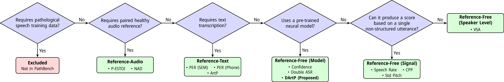

# PathBench

PathBench is a benchmark designed to evaluate pathological speech assessment systems.

## PathBench

## Usage guide

There are several use cases for PathBench:

* [I want to evaluate my newly developed predictor](https://www.google.com/search?q=%23i-want-to-evaluate-my-newly-developed-predictor)

* [I want to use the predictors developed by you](https://www.google.com/search?q=%23i-want-to-use-the-predictors-developed-by-you)

* [I want to contribute a new predictor to this repository, how do I do that?](https://www.google.com/search?q=%23i-want-to-contribute-a-new-predictor-to-this-repository-how-do-i-do-that)

* [I want to reproduce your research](https://www.google.com/search?q=%23i-want-to-reproduce-your-research)

### I want to evaluate my newly developed predictor

No install needed beyond numpy. Provide a CSV of predicted speaker scores and compare against the PathBench ground truth.

**Single dataset:**
```bash
python scripts/evaluate_from_csv.py \
    --predictions my_scores.csv \
    --ground-truth datasets/copas/pathological/word/balanced/spk2score
```

**Full benchmark** (results directory must mirror the dataset directory structure):
```bash
python scripts/evaluate_from_csv.py \
    --results-dir results/ \
    --datasets-root datasets/
```

Expected CSV format (`my_scores.csv`):
```
speaker_id,score
F01,2.5
M03,4.0
```

All speaker IDs in the CSV must match the ground truth exactly — the script exits with an error if any are missing from either side.

### I want to use the predictors developed by you

You have to install the framework but not download the stuff (datasets).

### I want to contribute a new predictor to this repository, how do I do that?

Please first look at the flow-chart below to decide where the model lies in this taxonomy. If you feel that your model doesn't fit this taxonomy, please open an issue, and we can discuss.



### I want to reproduce your research

Install and download everything.

After running the benchmark, verify that your evaluator implementations and datasets match the reference before comparing results.

**Check evaluator implementations:**
```bash
source tools/venv/bin/activate
python -m unittest tests.test_evaluators -v
```

All tests should pass. If all evaluator tests fail simultaneously, the reference audio file in `tests/data/test_audio.wav` may be corrupted — the `test_audio_integrity` test will confirm this.

**Check dataset integrity:**
```bash
# Print SHA256 hashes of your dataset files
python tests/test_evaluators.py --hash datasets/copas/pathological/word/balanced
```

Share these hashes alongside your results so others can verify they are using the same data.

## How do I download the required datasets?

We are not allowed to share these datasets ourselves, however, all of them are relatively easily accesible. Please get your copy.

* [COPAS](https://taalmaterialen.ivdnt.org/download/tstc-corpus-pathologische-en-normale-spraak-copas/)

* [EasyCall](http://neurolab.unife.it/easycallcorpus/)

* [TORGO](https://www.cs.toronto.edu/~complingweb/data/TORGO/torgo.html)

* [NeuroVoz](https://zenodo.org/records/10777657)

* [UASpeech](https://speechtechnology.web.illinois.edu/uaspeech/)

* Oral Cancer - YouTube

## Setup

Please route all wav.scp-s to your root.

## Quick start

The following code shows how to evaluate a dataset and get the correlation of each metric with the ground truth scores.

## Installation

To install the package, you can do the following: